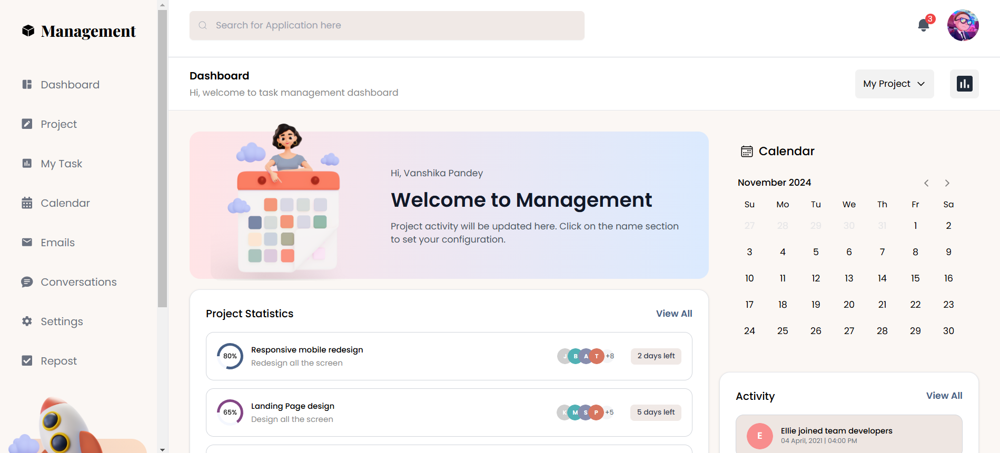

## 🌟 Management Dashboard with React, Tailwind, and Chart.js

Sleek and responsive _Management Dashboard_ application designed to simplify project and task management. This dashboard is built using React, Tailwind, and Radix UI, providing a modern and user-friendly interface with advanced charting and calendar features.

### 🎨 Based on a Figma Design

This project is inspired by a custom Figma design. The goal was to translate a pixel-perfect UI design into a functional and responsive dashboard using modern tools and technologies.

🔗[Figma Design](https://www.figma.com/community/file/1184024370301235727/management-dashboard)

### 🚀 Live Demo:

Check out the live demo: [Management Dashboard](https://cheerful-heliotrope-cd3f8e.netlify.app/)



### 🛠️ Tools & Technologies

#### Frontend

- React: Building user interface components.
- Radix UI: Accessible and customizable React primitives.
- Tailwind: Utility-first CSS framework for modern styling.

#### Data Visualization

- Chart.js: Interactive and customizable chart library.

### Installation

#### 1. Clone the repository:

```
git clone https://github.com/MihribanEvren/management-dashboard.git
```

#### 2. Install dependencies:

```
npm install
```

#### 3. Start the development server:

```
npm run dev
```

### 🙌 Contributing

Contributions are welcome! If you’d like to contribute to the project, feel free to fork the repository and submit a pull request.
